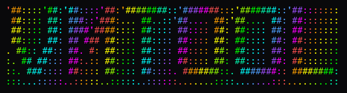

# VM-Diffing-Tool

A powerful web-based tool for analyzing and comparing virtual machine disk images. Built with Flask, C++ (pybind11), and libguestfs, this tool provides an intuitive interface for forensic analysis, backup verification, and VM state comparison.



## 🌟 Features

### VM Disk Analysis
- **List Files**: Browse all files in a VM disk image
- **File Contents**: View file contents with syntax highlighting
- **Disk Metadata**: View partition information, filesystem types, and disk properties
- **File Search**: Check if specific files exist in the VM

### Comparison Tools
- **File Compare**: Side-by-side comparison of files from different VM disks
- **Files Diff**: Compare file lists between two VM disks
- **Directory Compare**: Recursively compare directories across VM images
- **Export Reports**: Export comparison results as JSON or PDF

### User Management
- **Secure Authentication**: Email-based user registration with verification
- **Gmail OAuth**: Automated email verification system
- **Session Management**: Secure login/logout with Flask-Login

### Modern UI
- **Responsive Design**: Built with Pico CSS for clean, modern interface
- **Dark/Light Theme**: Toggle between themes with persistent preference
- **Interactive Tables**: AG Grid and DataTables for powerful data viewing
- **Real-time Notifications**: Flash messages with dismissible alerts

## 🏗️ Architecture

```
VM-Diffing-Tool/
├── backend/              # C++ core with pybind11 bindings
│   ├── src/
│   │   └── VMTool.cpp   # Core VM analysis logic
│   ├── include/
│   │   └── VMTool.hpp   # Header files
│   └── pybind11/        # Python bindings submodule
│   └── main.cpp        
├── frontend/   
│   ├── server/          # Flask web application
│   │   ├── app.py       # Main Flask application
│   │   ├── models.py    # Database models
│   │   ├── config.py    # Configuration
│   │   └── templates/   # HTML templates
│   └── vmtool_scripts/  # Frontend scripts
└── guestfs/             # Libguestfs Python bindings
```

## 🚀 Installation

### Prerequisites

- **Python 3.8+**
- **CMake 3.15+**
- **C++ Compiler** (GCC/Clang with C++17 support)
- **libguestfs** and dependencies
- **SQLite3**

### System Dependencies

```bash
# Ubuntu/Debian
sudo apt-get update
sudo apt-get install -y \
    python3-dev \
    python3-pip \
    cmake \
    g++ \
    libguestfs-dev \
    libguestfs-tools \
    python3-guestfs

# Fedora/RHEL
sudo dnf install -y \
    python3-devel \
    cmake \
    gcc-c++ \
    libguestfs-devel \
    libguestfs-tools \
    python3-libguestfs
```

### Build Backend

```bash
cd backend
git submodule update --init --recursive  # Initialize pybind11
mkdir build && cd build
cmake ..
make
sudo make install  # Or: export PYTHONPATH=/path/to/build
```

### Install Frontend Dependencies

```bash
cd frontend/server
pip install -r requirements.txt
```

### Configuration

1. **Create `.env` file**:
```bash
cp .env.example .env
```

2. **Configure Gmail OAuth** (for email verification):
```env
GMAIL_USER=your-email@gmail.com
GMAIL_APP_PASSWORD=your-app-password
EMAIL_VERIFICATION_REQUIRED=True
BASE_URL=http://localhost:8000
```

3. **Generate Secret Key**:
```python
python -c "import secrets; print(secrets.token_hex(32))"
```
Add to `.env` as `SECRET_KEY=<generated-key>`

## 🎯 Usage

### Start the Server

```bash
cd frontend/server
sudo python3 app.py
```

The server will start on `http://localhost:8000`

### First Time Setup

1. Navigate to `http://localhost:8000`
2. Click **Sign Up** to create an account
3. Verify your email (check inbox/spam)
4. Log in with your credentials

### Analyzing VM Disks

1. **List Files**:
   - Go to "List Files"
   - Enter VM disk path (e.g., `/path/to/vm.qcow2`)
   - Browse the file tree

2. **Compare Files**:
   - Go to "File Compare"
   - Enter two VM disk paths
   - Enter file path to compare
   - View side-by-side diff

3. **Directory Comparison**:
   - Go to "Compare Files In Directory"
   - Enter two VM disk paths and directory path
   - View comprehensive comparison report

4. **Export Results**:
   - Use "Export as PDF" or "Export as JSON" buttons
   - Save comparison reports for documentation

## 🔧 API Endpoints

| Endpoint | Method | Description |
|----------|--------|-------------|
| `/` | GET | Home dashboard |
| `/login` | GET/POST | User login |
| `/signup` | GET/POST | User registration |
| `/logout` | GET | User logout |
| `/list-files` | GET/POST | List files in VM disk |
| `/files-json` | GET/POST | Get file list as JSON |
| `/meta` | GET/POST | Get disk metadata |
| `/file-contents` | GET/POST | View file contents |
| `/file-compare` | GET/POST | Compare two files |
| `/files-diff` | GET/POST | Compare file lists |
| `/directory-diff` | GET/POST | Compare directories |
| `/verify-email/<token>` | GET | Email verification |

## 🛡️ Security

- **Password Hashing**: Werkzeug's secure password hashing
- **Email Verification**: Token-based email confirmation
- **Session Management**: Secure cookie-based sessions
- **CSRF Protection**: Built-in Flask CSRF protection
- **Input Validation**: Server-side validation for all inputs

## 🧪 Development

### Running in Debug Mode

The server runs in debug mode by default. Flask's auto-reloader will restart the server when code changes are detected.

### Database

SQLite database is created automatically at `frontend/server/database/users.db`

To reset the database:
```bash
rm -rf frontend/server/database/*
```

## 📝 Configuration Options

**Environment Variables** (`.env`):

- `SECRET_KEY`: Flask secret key for sessions
- `GMAIL_USER`: Gmail address for sending emails
- `GMAIL_APP_PASSWORD`: Gmail app-specific password
- `EMAIL_VERIFICATION_REQUIRED`: Enable/disable email verification (`True`/`False`)
- `BASE_URL`: Base URL for email verification links
- `EMAIL_VERIFICATION_TOKEN_MAX_AGE`: Token expiration time in seconds (default: 3600)

## 🤝 Contributing

Contributions are welcome! Please feel free to submit a Pull Request.

## 📄 License

This project is open source and available under the GPL-3.0 License.

## 🙏 Acknowledgments

- **libguestfs**: For VM disk access capabilities
- **pybind11**: For seamless C++ and Python integration
- **Flask**: For the web framework
- **Pico CSS**: For the beautiful UI

## 📞 Support

- For issues and questions, please open an issue on the project repository.
- Contact: [akashmaji@iisc.ac.in](mailto:akashmaji@iisc.ac.in)

---

**Built with ❤️ for VM analysis**
```
'##::::'##:'##::::'##:'########::'#######:::'#######::'##:::::::
 ##:::: ##: ###::'###:... ##..::'##.... ##:'##.... ##: ##:::::::
 ##:::: ##: ####'####:::: ##:::: ##:::: ##: ##:::: ##: ##:::::::
 ##:::: ##: ## ### ##:::: ##:::: ##:::: ##: ##:::: ##: ##:::::::
. ##:: ##:: ##. #: ##:::: ##:::: ##:::: ##: ##:::: ##: ##:::::::
:. ## ##::: ##:.:: ##:::: ##:::: ##:::: ##: ##:::: ##: ##:::::::
::. ###:::: ##:::: ##:::: ##::::. #######::. #######:: ########:
:::...:::::..:::::..:::::..::::::.......::::.......:::........::
```
